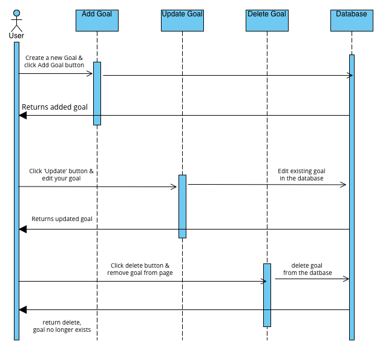

SETUP
1. Install flask, flask-SQLchemy
$ pip install flask, Flask-SQLAlchemy

2. Install the virtual environment to run the program
$ pip3 install virutalenv

3. create virtual environment
$ virtualenv myenv

4. Activate virtual environment
$ source myenv/bin/activate

5. Run the program
$ python3 app.py

5. See the program run on below address
$ localhost:2345 

6. Update the localhost port if necessary in the 'app.py'
$ app.run(debug=True, port=5000)

MICROSERVICE A INSTRUCTIONS
This microservice is responsible for handling goals including adding, updating and removing the goals.

1. Enter your goal and then click 'Add Goal'
2. Goal is entered, date added is displayed and an actions column
3. If you need to update the goal click 'Update' in the actions column 
4. To delete a goal no longer relevent or achieved, click 'Delete'

UML Sequence Diagram

COMMUNICATION CONTRACT - Examples
A) Request Data
    - Add a Goal
    - Endpoint '/api/goals'
    - Method: POST
    - Host: http://localhost:5000
    - Content-Type: application/json

B) Receive Data
    - Once goal is added, Microservice A responds to the goal including the goal's 'id', 'content' & 'date_created'
    {
        'id': 1,
        'content': 'Goal is to complete setup for Microservice A',
        'date_created': 2024-05-20'
    }
